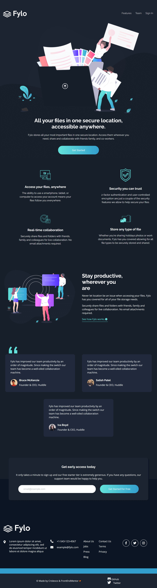

# Frontend Mentor - Fylo dark theme landing page solution

This is a solution to the [Fylo dark theme landing page challenge on Frontend Mentor](https://www.frontendmentor.io/challenges/fylo-dark-theme-landing-page-5ca5f2d21e82137ec91a50fd).

## Table of contents

- [Frontend Mentor - Fylo dark theme landing page solution](#frontend-mentor---fylo-dark-theme-landing-page-solution)
  - [Table of contents](#table-of-contents)
  - [Overview](#overview)
    - [The challenge](#the-challenge)
    - [Screenshot](#screenshot)
    - [Links](#links)
  - [My process](#my-process)
    - [Built with](#built-with)
    - [What I learned](#what-i-learned)
  - [Author](#author)

## Overview

### The challenge

Users should be able to:

- View the optimal layout for the site depending on their device's screen size.
- See hover states for all interactive elements on the page

### Screenshot

### Links

- [Solution URL:](https://www.frontendmentor.io/solutions/fylo-dark-with-grid-flexbox-and-bem-j3szE621E)
- [Live Site URL:](https://crisleoco2004.github.io/fylo-dark-landing-page/)

## My process

### Built with

- Semantic HTML5 markup
- CSS custom properties
- Flexbox
- CSS Grid
- Mobile-first workflow
- BEM

### What I learned

With the following challenge i could practice more about semantic html5, CSS (Flex, Grid & BEM).

## Author

- [Website](https://crisleoco2004.github.io/)
- [Frontend Mentor](https://www.frontendmentor.io/profile/Crisleoco2004)
- [Twitter](https://www.twitter.com/crisleooc)
